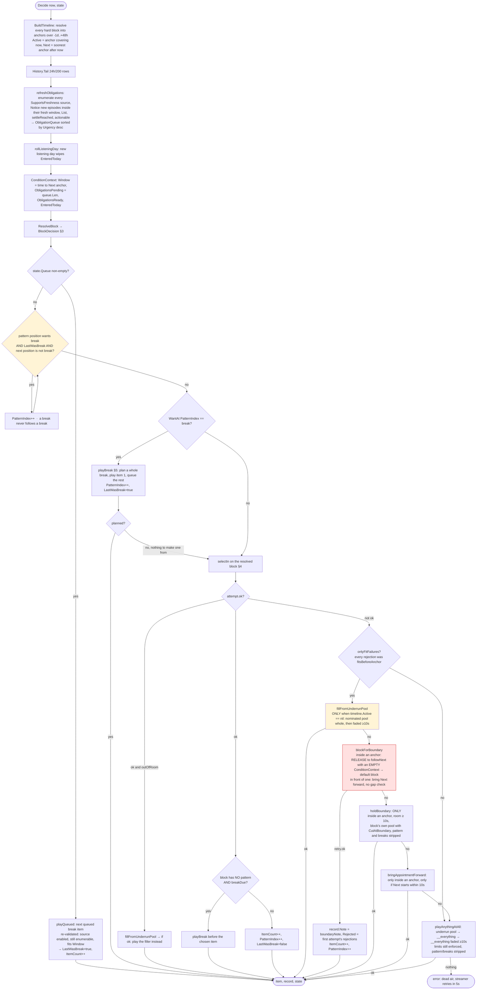
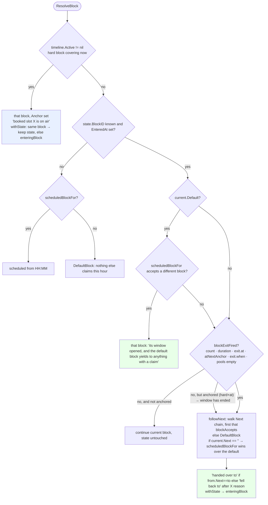
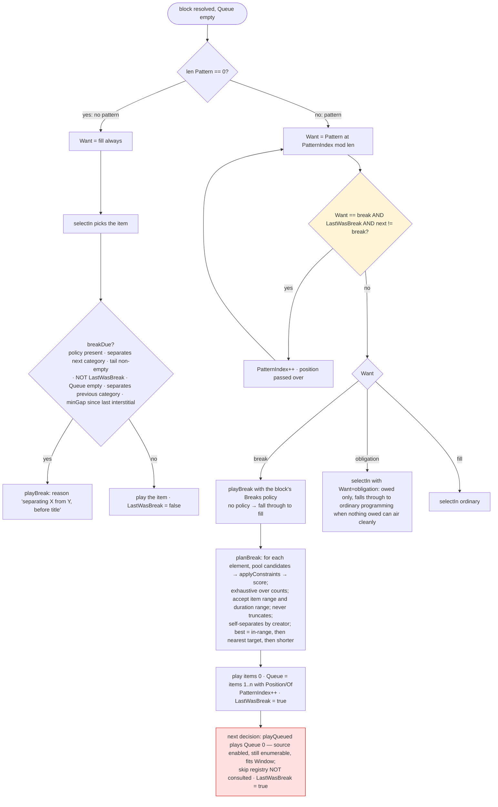
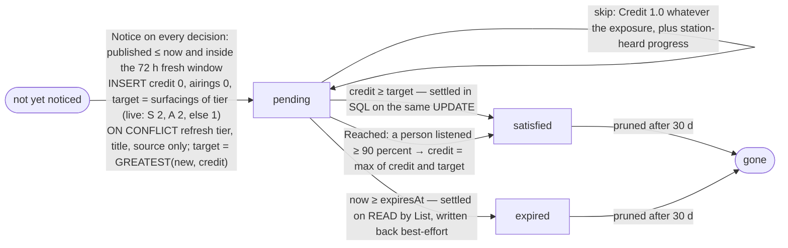
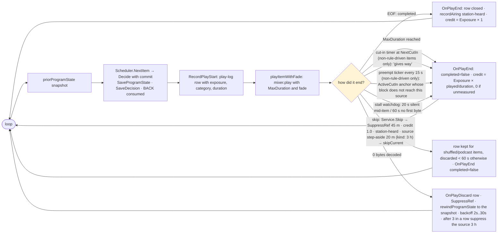

# samo-radio scheduler — the logic, as the code has it

Derived by reading `internal/channels` on 2026-09-17, not from the design
notes. Where the code contradicts the notes or the memory, the contradiction is
called out in §12. The three September incidents (§11) are annotated on the
diagrams as **A**, **B** and **C**.

**Which code is live.** The container `samo-docker-server-1` runs
`ghcr.io/bouliehaan/samo-server:latest`, built 2026-09-14 05:21 UTC — six hours
after the last edit of the uncommitted 2026-09-13 working tree. Every string
literal that diff adds (`the station has already aired this in full`,
`obligations.ready`, `the booked slot released early`, `closed %d play-log
row(s) left open by an earlier run`, …) is present in `/usr/local/bin/samo-server`
inside the container, and the `stationAired` reason appears verbatim in the live
decision records. **The live binary is commit `7198320` + the uncommitted 09-13
diff, i.e. this working tree.** All four mornings examined (09-14 → 09-17) ran
on it.

Every timestamp below is America/Denver, printed and sorted by the full
timestamp (the box is UTC; a station repeats daily, so time-of-day alone lies).

**Provenance.** This document describes the engine as it was on the box when
the incidents happened. The fix sessions that followed (P2 ordering —
`Obligation.Heard`, `unheardLift`; P3 boundary — `p3_boundary_test.go`) change
the code in the working tree after this reading; §6–§7 and §13 are the
*before* picture those fixes were written against. Where P3 changed what a
section says, a **P3 landed** block under it gives the code as it is now
(§3b, §3c, §5, §9, §13).

---

## 1. One decision, end to end

`Engine.Decide` (engine.go:105) is the whole pipeline. Everything the streamer
does — item end, cut, skip — ends in one more call to it.



**C** enters this graph at `A20 → A21 (skipped: Active != nil) → A22`: the
Morning Music Block, a hard anchor, released its 36-second tail to the *default*
block, whose window is the next anchor seven hours away.

---

## 2. What the engine reads before deciding

| Read | Where | Used by |
|---|---|---|
| Plan (stored, reconciled with schedule rules, else derived) | `Scheduler.PlanFor` | everything |
| ProgramState `{BlockID, EnteredAt, ItemCount, PatternIndex, LastWasBreak, EnteredToday, EnteredDay, Queue}` | `LoadProgramState` (`state_json`) | ResolveBlock, pattern, breaks, caps |
| Tail: last 24h / 200 rows, **overlapping** the window, with `Aired` and `Exposure` per row | `PlayLogTail` | end-time separation, CategoryRun, typical lengths, lastCategory |
| LastAiredByRef / BySource over the rerun horizon (30d), `LastLongFormBySource` over max(rerun, longForm.rest) | store | separation, restedness, rationing |
| AiredInListeningDay: rows **started** inside today's listening day (elapsed since 08:00) | store | airingCap |
| Airtime by source/category over the balance horizon (6h), by overlap | store | categoryDeficit, sourceDeficit |
| Obligations: pending + settled within 7d, expiry settled on read | `sqlObligations.List` | queue, Owed/Held flags |
| Listener progress per episode (person vs station) | `Listened.EpisodeProgress` | alreadyHeard, stationAired, settleReached |
| SkipRegistry (in memory) | `skips` | skipped constraint, BACK |

---

## 3. Block state machine — `ResolveBlock` (program.go:115)



`scheduledBlockFor` (program.go:363): among non-default blocks with `enter.at`,
the one whose window (`at` → `exit.at`, else the rest of that day, on its
`days`) contains now **and** `blockAccepts` (pools non-empty, `maxPerDay` not
spent, `when` true, window contains now); latest `at` wins. A block with `when`
but no `at` is a *mode* and only wins when no timed block does.

`blockAccepts` is also what `followNext` asks of each `next` — **with whatever
ConditionContext the caller passes**. `blockForBoundary` passes an empty one.

`enteringBlock` (program.go:654) builds the new state: `PatternIndex = 0`,
`ItemCount = 0`, `Queue = nil`; carries `LastWasBreak`, `EnteredDay`,
`EnteredToday(+1)`. **Every block entry restarts the pattern at position 0.**

What resets what:

| Field | Reset by | Set by |
|---|---|---|
| `PatternIndex` | any block entry (`enteringBlock`) | `++` after a fill, a break, a boundary retry; the break-follows-break skip-over |
| `LastWasBreak` | never on entry (carried) | `true` by playBreak/playQueued, `false` by an ordinary fill; **untouched** by a boundary retry, an underrun fill, hold, playAnythingAtAll |
| `Queue` | block entry; `playBreak` (replaced) | playBreak |
| `EnteredToday` | new listening day | `enteringBlock` |

### 3a. Entry kinds and what the timeline does with them

| `enter` | Anchor? | Effect |
|---|---|---|
| `at` + `hard` | **yes** — `BuildTimeline` resolves it into `Anchor{Start, End, Policy}` | wins ResolveBlock step 1 while it covers now; `Window` for everyone else is the time to its Start |
| `at` (soft) | no | eligible via `scheduledBlockFor` only; invisible to the timeline, so it is **not** a window boundary and cuts nothing |
| `after: X` | no | `X.next` — reached only by `followNext` when X exits |
| `when:` | no | mode; gates every entry route |
| `maxPerDay` | no | checked in `blockAccepts` before `when` |

The live plan's `fresh` block is `at: 08:00` **soft** + `when: obligations.pending > 0`.
It is therefore not an anchor: the record's `nextAnchor` at 08:59 on every
morning is *All things Considered 16:00*, seven hours out.

### 3b. Boundary order (the `onlyFitFailures` branch of Decide)

Code order, engine.go:215–287:

1. `fillFromUnderrunPool` — **returns false inside an anchor**. Outside: the
   nominated pool whole, then `holdBoundary` (faded, ≥ `minBoundaryFill` 10s).
2. `blockForBoundary` — inside an anchor: **release** to
   `followNext(plan, block, ConditionContext{}, now)`; the block's `next`
   chain is walked with an empty context (any `when` fails), and with no `next`
   it is the default block. It never asks `scheduledBlockFor`. In front of an
   anchor: the next anchor's block starts now, *without* the 10 s check.
3. `holdBoundary` — inside an anchor only, room ≥ 10 s, the block's own pool
   with `CutAtBoundary` (fitsBeforeAnchor stands down, `TargetDuration = gap`,
   `MaxDuration = gap`, 3 s fade).
4. `bringAppointmentForward` — only inside an anchor (`Active` and `Next` both set) and only across ≤ 10 s.
5. `playAnythingAtAll`.

So **inside a booked hour, release beats hold.** The released block's intent is
built with `block.Anchor == nil`, so `Window = timeline.Window()` = time to the
*next* anchor, and `PlayCeiling` likewise. Nothing about the released decision
remembers that the hour it is filling ends in 36 seconds.

The memory's description ("fill whole → release to next → hold → appointment
forward") is the order *for a gap outside an anchor*. Inside one, step 1 is
skipped and release comes first.

> **P3 landed (2026-09-18) — the order above is the *before* picture.** The
> body of `Decide` after `ResolveBlock` is now `Engine.program`, which the
> boundary handovers re-enter for the block they hand to (bounded by
> `handoverDepth` 2), so a handed-to block gets its own queue, cycle and
> breaks instead of a bare `selectIn`. The `onlyFitFailures` branch is now:
>
> **Inside a booked hour** (`timeline.Active != nil`):
> 1. `holdBoundary` — the block's OWN pool faded on the hour, room ≥ 10 s.
>    The cut pass refuses a programme (`falseStartIfCut`: anything that is
>    not a bag, a stream or a spot) unless `AllowFalseStart`, which only the
>    floor sets. A music hour ends on one more song; a podcast hour's tail is
>    never a podcast cut off.
> 2. `fillFromUnderrunPool` — the nominated gap pool, whole then faded. It is
>    no longer refused inside an anchor; it comes after the hour's own pool,
>    never instead of it.
> 3. `releaseAnchor` — hand the tail to `handoverFrom(plan, timeline, block,
>    cond, now)`, the same rule `ResolveBlock` uses (real `ConditionContext`,
>    `scheduledBlockFor` when the block names no `next`), and write
>    `ProgramState.ReleasedAnchor`/`ReleasedUntil`. `ResolveBlock` step 1 and
>    `Scheduler.ActiveCutIn` both stand down for a released anchor until its
>    window closes, so neither the next decision nor the watchdog takes the
>    hour back. The released block is programmed with `Active = nil`, so its
>    window is the next appointment's.
> 4. `bringAppointmentForward` — only across ≤ `minBoundaryFill`.
>
> **In front of an appointment** (`Active == nil`): `fillFromUnderrunPool`,
> then `bringAppointmentForward` — which no longer requires `Active` and is
> the ONLY way an appointment comes forward, so the ungated in-front branch of
> the old `blockForBoundary` (deleted) is gone. Then the floor.
>
> `fitsBeforeAnchor` also changed for the non-cut case: an item with no
> length is fitted as `assumedLength` — its show's median, else its
> category's median of show medians (`typicalLengths` over the shelf), else
> `countsAsAired` — instead of being waved through and capped to the window.
> Every boundary fallback's record now carries the original attempt's
> rejections first (`selection.explainedBy`), so "why did a song play in the
> show hour" is answerable from the record.

### 3c. `buildIntent` — the window rules (engine.go:1308)

- `Window = PlayCeiling = timeline.Window()` (time to Next anchor; 0 = unbounded).
- Anchored block: `PlayCeiling = Window = Anchor.End − now`; **the opening item
  (`ItemCount == 0`) gets `Window = 0`** — it may overrun and is cut at the
  boundary. That is why the 08:59:38 re-entry picked a full song for 22 s.
- `exit.at` on any block caps `PlayCeiling`; `exit.duration` sets
  `TargetDuration` and caps `Window = remaining + tolerance`.
- `CutAtBoundary` sets `TargetDuration = Window`. *(P3: `AllowFalseStart`
  travels alongside it; see §3b.)*
- `MaxUrgency` = max `Urgency` over `env.owed.Pending` — **held episodes
  included**, so `freshness` is normalised against something that may not be
  airable.

---

## 4. Candidate pipeline — `selectIn` (engine.go:1047)

```mermaid
flowchart TD
    S0(["selectIn block"]) --> S1["buildIntent §3c"]
    S1 --> S2["Enumerate: every pool of the block → pool.Resolve sources → enumerateSource<br/>dedupe on source+ref, PoolID/PoolWeight stamped<br/>podcast: newest 200, minItem floor, embargo, rerunMaxAgeDays<br/>playlist: whole playlist · files: rotating window · station/stream: one candidate"]
    S2 --> S3{"Considered == 0?"} -->|"yes"| SE1(["error: no pool could produce anything"])
    S3 -->|"no"| S4["BACK: PreferredRef narrows to the item, else PreferredSource narrows to the source"]
    S4 --> S5["fitSeparationToLibrary on the SHELF §7"]
    S5 --> S6["applyConstraints on candidates §4a: ladder relaxes highest RelaxOrder first"]
    S6 --> S7{"intent.Want == obligation?"}
    S7 -->|"yes"| S8{"owed among candidates?"}
    S8 -->|"none"| S9["Note: nothing is owed, ordinary programming"]
    S8 -->|"some, and some survived"| S10["survivors = owed survivors only · record.want = obligation"]
    S8 -->|"some, none survived"| S11["Note: nothing owed can air cleanly right now<br/>ordinary programming from the survivors"]
    S7 -->|"no"| S12
    S9 --> S12
    S10 --> S12
    S11 --> S12
    S12{"survivors empty?"} -->|"yes"| SE2(["error: every candidate was ruled out<br/>onlyFitFailures = all rejections are fitsBeforeAnchor"])
    S12 -->|"no"| S13["categoriesOutOfRun: a limited category whose owed items no longer fit its run is dropped"]
    S13 --> S14["categoriesOutOfRoom: a category the gap cut to stubs is dropped<br/>owed items exempt; never fires when cutAtBoundary or window unbounded<br/>if dropping would empty the set → outOfRoom noted instead"]
    S14 --> S15["dropBackCatalogueOfShowsAwaitingTheirNewEpisode<br/>show has an owed episode, none survived → its back catalogue set aside, never to silence"]
    S15 --> S16["dropBackCatalogueRunningIntoAHeldEpisode<br/>held show's back catalogue that would still run at day start − sourceSeparation"]
    S16 --> S17["preferOwedWithinCategory: any category with an owed survivor keeps ONLY owed"]
    S17 --> S18["preferDueLongForm: a rested non-owed giant takes its category from the back catalogue"]
    S18 --> S19["preferNoStub: prefer items whose remainder is 0 or ≥ shortest shelf item, ceiling = PlayCeiling"]
    S19 --> S20["scoreEnv + adoptSeparation → scoreCandidates §6"]
    S20 --> S21["chooseCandidate: band = 15% of top; if top is owed → contenders = owed with Urgency within 0.001 of the most urgent; weighted draw"]
    S21 --> S22["Materialise winner, then next scored on failure → unplayable recorded"]
    S22 --> S23["applyDuration: anchored → IsRuleDriven, MaxDuration = anchor end<br/>cutAtBoundary → MaxDuration = window, 3 s fade<br/>unmeasured non-live → MaxDuration = window<br/>live → playMinutes/PlayCeiling/limit remaining"]
    S23 --> S24["Exposure = ExposureOver block, now..now+plannedSpan"]
    S24 --> SD(["item + record"])

    style S17 fill:#e8ffe8
    style S21 fill:#ffe0e0,stroke:#c00
    style S6 fill:#fff4d6
```



**A** and **B** are decided at `S17 → S20 → S21`: after `preferOwedWithinCategory`
only owed talk remains; `freshness = Urgency / MaxUrgency` dominates the score
(weight 4); and `chooseCandidate` then throws away every contender that is not
*equally urgent* to the most urgent survivor. There is no term anywhere on this
path that reads `Credit` except the separation windows.

### 4a. Hard constraints — `standardConstraints` (constraints.go:109)

Checked per candidate in this order; the first failure is the recorded
rejection. When nothing survives, `dropMostRelaxable` removes the rule with the
**highest** RelaxOrder and the pass is re-run; rules below zero never relax.

| # | Rule | RelaxOrder (higher = given up first) | Refuses when |
|---|---|---|---|
| 1 | `heldForTheListeningDay` | 12 | candidate.Held (new, outside the listening day, still fresh at next day start) |
| 2 | `alreadyHeard` | 3 | a **person** listened ≥ 90% (or ≥ 120 s if unmeasured) |
| 3 | `stationAired` | 11 | the station aired it in full **and** it is not owed/held |
| 4 | `familySeparation` | 10 | since last family airing < window (owed: window × that airing's exposure) |
| 5 | `creatorSeparation` | 9 | as above, creator; per-creator fitted window may replace it |
| 6 | `sourceSeparation` | 8 | SharedCreator sources only; keyed on the **show**, later of source/show; owed: exposure-scaled |
| 7 | `itemSeparation` | 7 | shuffled: turn readiness < 1; else since last airing < window × **Credit** (owed) or full window |
| 8 | `categoryRunLimit` | 6 | run ≥ max and another category is present |
| 9 | `longFormRationing` | 4 | non-giant of a show whose giant aired < showQuietAfter; giant of a show that aired < rest (never for owed); rest `never` refuses every non-owed giant |
| 10 | `airingCap` | 5 | listening-day airings ≥ limit; owed: `chargeableAirings(count, credit)` and limit raised to ⌈Target⌉ |
| 11 | `itemFitsRun` | 1 | duration > limit.Remaining |
| 12 | `skipped` | 2 | ref suppressed (45 m) or source suppressed (20 m item skip / 3 h kind skip) |
| 13 | `fitsBeforeAnchor` | **−1 never** | duration > Window; stands down entirely when `cutAtBoundary`; unmeasured/live pass |

Relaxation order therefore: held → stationAired → family → creator → source →
item → runLimit → airingCap → longForm → alreadyHeard → skipped → itemFitsRun.
`fitsBeforeAnchor` is the only rule that survives every rung.

`readyObligations` (the `obligations.ready` condition) runs **one strict pass,
no relaxation**, against the whole shelf; the live plan does not use it.

---

## 5. Break and cycle machine



Notes that matter for **C**:

- The pattern position is what `PatternIndex` says, and `enteringBlock` sets it
  to 0. The `fresh` block's pattern is `[break, obligation]`, so **every entry
  of `fresh` opens with a break** unless `LastWasBreak` is already true.
- `LastWasBreak` is set only by playBreak/playQueued. A block whose items are
  ordinary fills — the Morning Music Block, sixty minutes of songs — leaves it
  `false`. The skip-over at B8 therefore does not fire when `fresh` is entered
  from an hour of music, and the block opens with more music. `breakDue`
  (pattern-less blocks) does have the right check — `policy.separates(previous.Category)`
  — but pattern-driven breaks never consult it.
- A **skip does not clear the queue**: `Service.Skip` suppresses the ref and
  steps off the source, `skipCurrent` cancels the item, and the next decision
  runs `playQueued` first, which re-validates only `src.Enabled` — not the skip
  registry. The second song of a planned break plays after the first was skipped.

> **P3 landed (2026-09-18).** B8 is now `Engine.skipPointlessBreaks`: a
> pattern's break position is passed over when `LastWasBreak` OR
> `breakFollowsItsOwnMaterial(policy, tail)` — the last thing aired is not a
> category the policy `separates`, or its source is in one of the break's
> pools, or is the same material (`sameMaterial`: same kind, both spots or
> neither) as what those pools hold. The second reading is what catches his
> Morning Music Block: a music-playlist booked as a show is categorised `talk`
> by `LegacyCategoryOf` (role ≠ music), so the category check alone would
> still have opened `fresh` with a break. The same test gates `breakDue` for
> pattern-less blocks. And B16: `playQueued` now drops a queued item whose
> source is stepped off or whose ref is suppressed — one skip reaches the next
> programming position.

---

## 6. Soft scoring and the choice (score.go)

`total = Σ value × weight`, terms with value 0 are omitted from the record.

| Term | Weight | Value | Horizon / notes |
|---|---|---|---|
| `freshness` | **4.0** | owed: `Urgency / MaxUrgency` clamped 0..1; not owed: 0 | MaxUrgency over all pending incl. held |
| `runContinuity` | 2.5 | same category as last aired and its `minUnbroken` run not yet met: `(min − run)/min` | block limits |
| `categoryDeficit` | 1.0 | `target − actual share` over the balance window | 6 h, overlap-measured, interstitials excluded |
| `recency` | 0.9 | not owed: `horizon/(horizon+age)`; undated = 0; owed = 0 | 14 d |
| `windowFit` | 0.8 | `1 − |dur − TargetDuration|/TargetDuration` when a target exists | exit.duration / CutAtBoundary only |
| `sourceDeficit` | 0.6 | `sourceShare − actual`; shares split by weight, bags by depth | 6 h |
| `restedness` | 0.4 | min over item/show/creator of `since / (2 × window × exposure)`; shuffled: turn readiness | uses the fitted windows |
| `poolWeight` | 0.3 | `PoolWeight / maxPool` | |
| `commitment` | 0.15 | giants only: `−log2(dur / typical of category)` | longForm threshold 2 h |

`chooseCandidate` (score.go:471): sort desc; `band = ε × |top|` with ε = 0.15;
contenders = everything within the band; **if the top is owed, contenders are
narrowed to owed candidates whose Urgency is within 0.001 of the most urgent
contender**; one contender → "highest scoring candidate", else a draw weighted
by distance above the band floor. Seed = plan seed ⊕ the decision's second, so a
peek and the real decision agree.

Consequence: among owed talk the score is decorative. `freshness` is a monotone
function of Urgency, and the contender narrowing reduces the choice to
"the most urgent obligation that survived the constraints". **The obligation
queue's order is the running order**, exactly as the memory says — and the
queue's order is §7's `Urgency`, which does not know whether the listener has
heard the episode.

---

## 7. Obligation lifecycle (obligations.go, store_obligations.go, service.go)



**Credit** (service.go:729): `credit = item.Exposure × playedFraction`.
`Exposure` is stamped at decision time: the block's own `exposure` if set, else
the listening-day overlap of `[now, now + plannedSpan)` where `plannedSpan` is
the capped span. `playedFraction` = 1 on a clean end; on a cut,
`played / DurationSeconds`; **on a cut of an unmeasured item, 0**. (Lex Fridman
#502 has aired twice for 25 + 54 minutes, both cut by the 16:00/22:00 anchors,
and still reads credit 0, airings 0.)

**Urgency** (obligations.go:166) — the *only* ordering of what is owed:

```
Urgency = tierSpread × tierValue                  tierSpread 2.0; S 6, A 5, B 4, C 3, D 2, E 1, F 0
        + recencyWeight × (1 − age/window)        recencyWeight 1.0; window = expiresAt − publishedAt (72 h)
        + expiryWeight × (f − 0.8)/0.2  if f > 0.8 expiryWeight 1.5
```

Inputs: tier, published, expires, now. **Not** credit, not airings, not target.
An S-tier episode heard once (credit 1 of 2) keeps the full S urgency; an
A-tier episode nobody has heard is `≈ 2` below it whatever their ages; a
B-tier one is `≈ 4` below an A-tier heard-once.

Where credit *is* read: `itemSeparation` (`window × Credit` for owed),
`airingCap` (`chargeableAirings` and the ⌈Target⌉ limit), `stationAired`
(exempts owed), `longFormRationing` (exempts owed), and `preferDueLongForm`
(exempts owed). Nothing on the ranking path.

`Owed` vs `Held` (candidates.go:295): a pending obligation's candidate is
`Held` when `holdForListeningDay` — now is outside the listening day and the
next day start is still inside the fresh window — else `Owed` with `Urgency`,
`Credit`, `Target` copied from the row.

Ready vs pending: `obligations.pending` counts every pending row (second
surfacings, held, unfit); `obligations.ready` counts pending rows that pass one
strict constraint pass. The live `fresh` block exits on `pending == 0`.

---

## 8. Separation, caps, long-form, rationing

**Windows** (defaults; live plan sets none): item 8 h, source 45 m, creator 90 m,
family 45 m. Measured from the **end** of the last airing (`withEndTimes`
overlays the store's MAX(started_at) with tail end-times for anything in the
24 h tail).

**Scaling for owed candidates** (`separationFor`, constraints.go:608): source,
creator and family windows are multiplied by the *last airing's exposure*;
item windows by the candidate's *own credit*. Ordinary programming keeps the
full window. A 15-second airing inside the listening day has exposure 1.0, so
it binds the show for the full 45 minutes.

**`fitSeparationToLibrary`** (constraints.go:698), applied to the shelf once per
decision and adopted by scoring: each window = min(configured,
`(distinct − 1) × typical × 0.75`) where distinct counts shows / creators /
families / items; ≤ 1 distinct → 0. Per-creator: an artist who is share *s* of
the shelf gets `typical × (1−s)/s × 0.75`, or 0 below one typical item.
Playlists: `HasCreator = false` — no artist separation at all; a playlist is a
shuffle bag: `queueReadiness` ranks a source's items by last airing, the most
recent `n − max(3, 10%)` are "still in the bag", never-aired items are ready.

**Traits** (traits.go): podcast = SupportsFreshness + HasCreator + SharedCreator;
playlist = Shuffled, no creator; station/stream = Continuous + SharedCreator;
role commercial = Interstitial. `ShowOf` = podcastId/stationId/playlistId →
family → creator → source id.

**Airing cap** (`maxAiringsPerDay`, rotation.go:36): `min(3, ⌊2 h / duration⌋)`,
at least 1; unmeasured → 1. Counted over airings **started** inside the current
listening day. Owed: count = `max(min(count, ⌊credit⌋), count − 2)`, limit
raised to ⌈Target⌉.

**Long-form** (live: threshold 2 h, rest 21 d): a non-owed giant is refused while
its show aired a giant within `rest`; any non-owed episode of a show is refused
for `showQuietAfter = 24 h per hour of giant, capped at rest` after a giant;
`preferDueLongForm` then gives a rested non-owed giant precedence over its
category's back catalogue. Owed episodes are exempt from all three.

**Run limits** (`limits.maxUnbroken`, none in the live plan): `CategoryRun`
bounded by the block's `EnteredAt`, `resetAfter` of other content clears it;
`Remaining()` reaches zero; `itemFitsRun` measures every item against
`Remaining()`; `categoriesOutOfRun` ends the run when owed items no longer fit.

---

## 9. Events that re-run a decision (streamer.go)



- `NextCutIn` = the next anchor's start if its policy is `startImmediately`;
  the cut timer fires exactly then and asks the scheduler nothing.
- `ActiveCutIn` (scheduler.go:476) = the anchor covering now (policy
  `startImmediately`) and the sources its block's pools reach. `shouldPreempt`
  cuts when `anchor.BlockID != item.AnchorBlockID` and the item's source is not
  among them. **An item released early from a booked hour is not rule-driven,
  carries no `AnchorBlockID`, and the hour is still active — so the next tick
  cuts it.** `preemptTick` is 15 s.
- Rule-driven items (anchored blocks) have no watchdog; they end on
  `MaxDuration` = the anchor's end.
- **P3 landed (2026-09-18).** Every canceller now records a `cutCause`
  (`cutBySkip`, `cutByBoundary`, `cutByPreempt`, `cutByStall`) before it
  cancels, and the loop reads it once. `falseStart(item, played, completed,
  cause, err)` is true when the STATION ended a programme — boundary, preempt,
  or the play window's deadline — before `countsAsAired` (60 s) of it went
  out; never for a skip or a stall, never for a shuffled bag or a relay. A
  false start takes the W4 path minus the suppression: `OnPlayDiscard` the row,
  no `OnPlayEnd` (so no credit, no station-heard), `rewindProgramState` to the
  snapshot. `ActiveCutIn` returns false for a released anchor
  (`ProgramState.released`), so the preempt ticker no longer cuts the item a
  release chose.
- The streamer's logger runs at DEBUG; the container logs at INFO, so none of
  "preempting", "gives way", "went quiet" reach `docker logs`. Absence of a log
  line is not evidence.

---

## 10. The live plan (GET /plan, 2026-09-17)

- `listeningDay` 08:00–23:00 · `freshness.surfacings` S 2, A 2 · `longForm`
  2 h / 21 d · `horizons.recency` 14 d · `underrunPool: music` · categories
  talk target 1, music target 0 · separation/selection defaults.
- `general` (default): pools `[podcasts]`; breaks between talk, 25 m / 7 items,
  accept 18–32 m / 5–9, one music `fill` element; no pattern.
- `fresh` "New episodes": `enter {at 08:00, days *, when obligations.pending > 0}`
  — **soft**; `exit {when obligations.pending == 0}`; `next general`; pools
  `[podcasts]`; breaks 6 m / 2 items, accept 3–9 m / 1–2; **pattern
  `[break, obligation]`**.
- `slot-…7f870fc7` "Morning Music Block": `enter {at 08:00, days *, hard,
  startImmediately}`, `exit {at 09:00}`, pool = its own playlist, **no `next`**.
- 21 other `slot-` blocks (Lofi 00:00–08:00, ATC 16:00–17:00 Mon–Fri, Elvis
  17:00–18:30, Marketplace 18:30–19:00, evening shows, Lofi 23:00–00:00), all
  hard, all `startImmediately`, none with `next`.

`pools.music` matches every `music-playlist` source, so both the Explore
playlist and the Morning Music Block playlist are break inventory.

---

## 11. The incidents — decision records, verbatim

The play log (`/recent`, 200 rows, 09-13 09:08 → now) places **C on 2026-09-15
(twin on 09-14)** and **B on 2026-09-15 08:59:23**, not on 09-17. The 09-17
morning shows the same *mechanisms* with different outcomes and is given after
each record. Records beyond the API's 50-row cap were read straight from
`channel_decisions` on the box.

### 11.B — Stavvy's World (S, heard once) ahead of three never-aired A-tier — 2026-09-15 08:59:23

Preceded by: 08:57:15 "Intro" (Morning Music Block, 128 s) → ended 08:59:23.

```
at            2026-09-15 08:59:23   block general "General rotation"   enteredAt 08:59:23.56
entryReason   the booked slot had no room left for another item
exitReason    runs until something else claims the hour
note          the booked slot released early — nothing the station owns fits the 36s left of it
nextAnchor    All things Considered 16:00 (in 7h1m, startImmediately)   windowSeconds 25236
targets       talk 100% target / 100% actual / 359 min
considered    4896
rejected (carried from the first attempt inside the music block; all 24 shown)
   fitsBeforeAnchor ×24   e.g. "The Night We Met: 3m0s long, but only 36s until the next booked slot"
owed (top 6 by urgency)
   S  credit=1  urg 12.60  age 1739m  exp 43h1m   Stavvy's World          #198 - Nikki Glaser and JP McDade
   A  credit=0  urg 10.92  age  359m  exp 66h1m   The Harland Highway     MATAN introduces SPIDER-GIRL to the world! …
   A  credit=0  urg 10.89  age  479m  exp 64h1m   The Best of Car Talk    #2674: Empathic Whatever
   A  credit=0  urg 10.88  age  505m  exp 63h35m  The Church of What's Happening   The beginning of a new chapter
   A  credit=1  urg 10.54  age 1974m  exp 39h6m   Comedy Bang Bang        Male Loneliness Empanada …
   B  credit=0  urg  8.94  age  240m  exp 68h0m   Ask Dr. Drew            Feminism On Trial …
candidates (8, all owed after preferOwedWithinCategory; C = contender)
 C 4.72 102m  #198 - Nikki Glaser and JP McDade   sourceDeficit 0.036×0.6  freshness 1.000×4  restedness 1×0.4  poolWeight 1×0.3
   4.19  77m  MATAN introduces SPIDER-GIRL …      sourceDeficit 0.04×0.6   freshness 0.87×4   restedness 1×0.4  poolWeight 1×0.3
   4.18  34m  #2674: Empathic Whatever            sourceDeficit 0.04×0.6   freshness 0.86×4   restedness 1×0.4  poolWeight 1×0.3
   4.18  76m  The beginning of a new chapter      sourceDeficit 0.04×0.6   freshness 0.86×4   restedness 1×0.4  poolWeight 1×0.3
   4.07  93m  Male Loneliness Empanada            sourceDeficit 0.04×0.6   freshness 0.84×4   restedness 1×0.4  poolWeight 1×0.3
   3.56  97m  Feminism On Trial …                 sourceDeficit 0.04×0.6   freshness 0.71×4   restedness 1×0.4  poolWeight 1×0.3
   2.80  40m  How Ramen Saved Japan               (not owed) freshness 0.52×4 …
   2.73 142m  How to Optimize Your Water Quality  (not owed) freshness 0.68×4  commitment -4.88×0.15
selected      #198 - Nikki Glaser and JP McDade   score 4.7214   reason "highest scoring candidate"   owed true
```

Arithmetic, from `Obligation.Urgency`: #198 = 2.0×6 + (1 − 1739/4320) = 12.5975;
MATAN = 2.0×5 + (1 − 359/4320) = 10.917; Empathic = 10.889; new chapter = 10.883.
`freshness` = urgency / 12.5975 → 1.000 / 0.867 / 0.864 / 0.864. The winner's
credit of **1.0** (aired in full 09-14 11:56–13:38) appears in the record and
nowhere in the arithmetic. The rejections shown are the music-block attempt's —
the boundary retry overwrites its own (engine.go:249) — but all three A-tier
episodes appear among the scored candidates, so they survived every rule and
lost on the contender narrowing alone (`contender: true` on one line).

**Mechanism (one sentence):** `Obligation.Urgency` (obligations.go:166) ranks
by tier + age with no term for credit, `scoreEnv.freshness` (score.go:203) is
that number normalised, and `chooseCandidate` (score.go:508) narrows contenders
to the most urgent owed candidate — so an S-tier second surfacing outranks any
A-tier first surfacing by a full tier step.

### 11.A — Comedy Bang Bang (A, heard once) ahead of never-aired episodes — 2026-09-15 12:25:56

Preceded by: 12:20:07 "Watermelon Sugar", 12:23:02 "Dark Red" (a planned
2-item `fresh` break after "The beginning of a new chapter" ended 12:20:07).

```
at            2026-09-15 12:25:56   block fresh "New episodes"   enteredAt 09:00:00   entryReason continuing
exitReason    when obligations.pending == 0        want obligation
nextAnchor    All things Considered 16:00 (in 3h34m)   windowSeconds 12843   considered 4896
targets       talk 100% / 95% / 343 min
owed (top 6)
   S  credit=1  urg 12.55  age 1945m  Stavvy's World          #198 - Nikki Glaser and JP McDade
   A  credit=1  urg 10.87  age  565m  The Harland Highway     MATAN introduces SPIDER-GIRL …
   A  credit=1  urg 10.84  age  685m  The Best of Car Talk    #2674: Empathic Whatever
   A  credit=1  urg 10.84  age  711m  The Church of What's Happening   The beginning of a new chapter
   A  credit=1  urg 10.50  age 2180m  Comedy Bang Bang        Male Loneliness Empanada …
   B  credit=0  urg  8.98  age   85m  The Joe Rogan Experience   #2554 - Carlo Rovelli
rejected (owed first)
   itemSeparation     #198 - Nikki Glaser …:      this item aired 3h26m0s ago, needs 8h2m0s apart      ← window 8h × credit 1.0049; "3h26m ago" is the 15 s false start
   itemSeparation     MATAN introduces …:         this item aired 2h11m0s ago, needs 8h0m0s apart
   sourceSeparation   The beginning of a new chapter: this show aired 6m0s ago, needs 45m0s apart
   creatorSeparation  #2674: Empathic Whatever:   The Best of Car Talk aired 1h29m0s ago, needs 1h30m0s apart
   fitsBeforeAnchor ×20 (Hardcore History giants, 3h51m–4h14m against 3h34m)
candidates (5, owed only)
 C 4.11  93m  Male Loneliness Empanada   categoryDeficit 0.045×1  sourceDeficit 0.036×0.6  freshness 0.836×4  restedness 1×0.4  poolWeight 1×0.3
   3.60  97m  Feminism On Trial …        categoryDeficit 0.05×1   sourceDeficit 0.04×0.6   freshness 0.71×4   restedness 1×0.4  poolWeight 1×0.3    (B, credit 0, never aired)
   2.89 158m  #2554 - Carlo Rovelli      categoryDeficit 0.05×1   sourceDeficit 0.04×0.6   freshness 0.72×4   restedness 1×0.4  commitment -4.92×0.15  poolWeight 1×0.3   (B, credit 0, never aired)
   2.84  40m  How Ramen Saved Japan      (not owed)
   2.78 142m  How to Optimize Your Water Quality  (not owed)
selected      Male Loneliness Empanada   score 4.1121   "highest scoring candidate"   owed true
```

The premise "never-aired **A-tier** episodes from other shows" is not what the
record shows: by 12:25 every other A-tier episode had aired once and was held by
a separation rule (one of them by *sixty seconds* of creator separation). The
never-aired episodes that lost were **B-tier**: Dr. Drew "Feminism On Trial"
(97 m, published 04:59) and JRE #2554 (158 m). Their urgency: 8 + (1 − 240/4320)
= 8.94 and 8 + (1 − 85/4320) = 8.98, against the heard-once A at 10 + (1 −
2180/4320) = 10.50. Feminism (3.60) was inside the 15% band (floor 3.49) and was
still discarded by the equal-urgency narrowing.

Same shape on 2026-09-17, the day named in the report: at **12:15:45**
"205: Superstar" (lemonparty, A, credit 1, urg 10.41) beat four never-aired
B-tier episodes — Dr. Drew "Tylenol …" 67 m, Lex #502, Huberman "Improve
Flexibility …" 126 m, JRE #2555 "Ron White" 154 m (freshness 0.66–0.68 vs
0.81) — and at 13:41:59 "The beginning of a new chapter" (A, credit 1) did it
again. The CBB pick of that morning, "Bonus Bang: Coma Pants" at 10:51:29, was a
**first** airing (credit 0, urg 10.85) and was the correct choice. JRE #2554
"Carlo Rovelli" has still never aired; it expires 09-18 11:00.

**Mechanism:** identical to B — one tier step of `Urgency` outranks the
difference between heard-once and never-heard, and nothing reads credit until
separation. **A and B are one cause.**

### 11.C — the 08:59 tail — 2026-09-15 08:59:23 → 09:00:26

Play log, 2026-09-15:

```
08:57:15  Intro                              128 s   Morning Music Block
08:59:23  #198 - Nikki Glaser and JP McDade   15 s / 6130 s   Stavvy's World (S)   ← released-early podcast, cut
08:59:38  12 to 12                             22 s   Morning Music Block          ← anchor re-asserted, MaxDuration 22 s
09:00:00  I Just Might                         18 s   Explore                      ← fresh block break 1 of 2, SKIPPED
09:00:18  Enjoy the Silence                     8 s   Explore                      ← break 2 of 2 from the queue, SKIPPED
09:00:26  MATAN introduces SPIDER-GIRL …     4491 s   The Harland Highway (A)
```

Twin, 2026-09-14: 08:58:45 #198 for 15 s (1m0s tail) → 08:59:00 "Lovefool"
59 s → 09:00:00 two full songs → 09:08:08 WAN Show (S). Variants with a tail
shorter than the 15 s tick: 09-16 08:59:50 (10 s) Ep 636 (S, 73 m) and 09-17
08:59:52 (8 s) Bonus #198 (S, 7 m) were **not** cut, ran to their end, and only
then did `fresh` enter — with a break.

ProgramState across the window (from the records; `state_json` is not exposed
by the API):

| at | BlockID | EnteredAt | PatternIndex | LastWasBreak | Queue |
|---|---|---|---|---|---|
| 08:57:15 | slot MMB | 08:00:00 | n/a (no pattern) | false | — |
| 08:59:23 | general | 08:59:23 | 0 → 1 | false | — |
| 08:59:38 | slot MMB | 08:59:38 | 0 → 1 | false | — |
| 09:00:00 | fresh | 09:00:00 | 0 → 1 (break) | true | [Enjoy the Silence 2/2] |
| 09:00:18 | fresh | 09:00:00 | 1 | true | [] (played from queue) |
| 09:00:26 | fresh | 09:00:00 | 1 → 2 (obligation) | false | — |

Record 08:59:23 — identical shape to 11.B (it *is* 11.B): `general`, "the
booked slot had no room left for another item", note "released early — nothing
the station owns fits the 36s left of it", `windowSeconds 25236`, 24 ×
`fitsBeforeAnchor` carried from the music-block attempt, winner the 102-minute
S-tier episode.

Record 08:59:38 (15 s later — `preemptTick`):

```
block slot-csched_7f870fc7… "Morning Music Block"   enteredAt 08:59:38.83
entryReason   booked slot "Morning Music Block" is on air (08:00–09:00)   exitReason runs until 09:00
windowSeconds (none: opening item of an anchored block)   considered 99
rejected      itemSeparation ×24   e.g. "The Night We Met: only 28% of the way through its playlist's turn"
candidates    36 in the band, all score 1.20 (sourceDeficit 0.84×0.6 restedness 1×0.4 poolWeight 1×0.3)
selected      12 to 12   "weighted pick among 36 candidates within reach of the top score"
```

Record 09:00:00:

```
block fresh "New episodes"   enteredAt 09:00:00.10
entryReason   fell back to after "Morning Music Block" (reached 09:00)
exitReason    when obligations.pending == 0        considered 0
break         items ["I Just Might", "Enjoy the Silence"]  7 min against a 6 min target  inRange true
              reason "the cycle calls for a break here"   position 1 of 2
owed          unchanged from 08:59:23 (S #198 still credit=1, urg 12.6 at the top)
selected      I Just Might   "break: the cycle calls for a break here"
```

Record 09:00:18 (skip #1):

```
block fresh   entryReason continuing   considered 0
break         items ["Enjoy the Silence"]  position 2 of 2
selected      Enjoy the Silence   "part 2 of 2 of a planned break"
```

Record 09:00:26 (skip #2):

```
block fresh   entryReason continuing   want obligation   windowSeconds 25173   considered 4896
rejected      sourceSeparation   #198 - Nikki Glaser …: this show aired 48s ago, needs 45m0s apart   ← the 15 s false start
              stationAired ×12, longFormRationing ×11 (JRE giants, "this show aired 11h15m ago")
candidates    7 owed:  C 4.19 MATAN (A, urg 10.92) · 4.18 Empathic Whatever · 4.18 The beginning of a new chapter
              · 4.07 Male Loneliness Empanada · 3.56 Feminism On Trial · 2.80 / 2.73 back catalogue
selected      MATAN introduces SPIDER-GIRL …   score 4.189   "highest scoring candidate"   owed true
```

What the 15-second airing wrote: a `channel_play_log` row (started 08:59:23,
ended 08:59:38, exposure 1.0, category talk); `OnPlayEnd` credit
`1.0 × 15/6130 = 0.0024` (the row now reads credit 2.0049 / target 2.0049 after
its later full airing — the `GREATEST(target, credit)` refresh); `airings + 1`;
**no** station-heard progress (only clean ends write it). Through the tail
overlay it moved the show's last-airing end to 08:59:38 and the item's to the
same — so at 09:00:26 the S-tier episode was refused by `sourceSeparation`
(48 s / 45 m, exposure-scaled to the full window because the false start was
inside the listening day), and at 12:25:56 still by `itemSeparation`
(3h26m / 8h2m). It aired at 19:07. The false start cost the S-tier second
surfacing the whole afternoon.

**Mechanism (one sentence each):**

1. Release: `Engine.Decide` engine.go:245 → `blockForBoundary` engine.go:1269
   — inside the anchor, `fillFromUnderrunPool` is skipped (engine.go:507) and
   the 36-second tail is released to `followNext(plan, block, ConditionContext{}, now)`
   = the default block, whose `buildIntent` has no anchor and therefore a
   7-hour `Window`, so a 102-minute episode passed `fitsBeforeAnchor`.
2. Cut: `channelStreamer.playItemWithFade` streamer.go:823 — the released item
   is not rule-driven, so the 15 s `preemptTick` watchdog asked
   `Scheduler.ActiveCutIn` (scheduler.go:476), found the Morning Music Block
   still active until 09:00 with pools that do not reach Stavvy's World, and
   `shouldPreempt` cancelled the item; the re-decision re-entered the anchored
   block, whose opening item is exempt from the fit rule (`ItemCount == 0 →
   Window = 0`, engine.go:1365) and capped at 22 s (`applyDuration`, engine.go:1947).
3. Break: at 09:00 `ResolveBlock` program.go:151 fired `exit.at 09:00`,
   `followNext` found no `next`, `scheduledBlockFor` returned `fresh`,
   `enteringBlock` program.go:654 reset `PatternIndex` to 0, and position 0 of
   `[break, obligation]` is a break; `LastWasBreak` was false because the music
   block's songs are fills, so the skip-over at engine.go:153 did not fire.
4. Two skips: `Engine.playQueued` engine.go:876 plays the queued second item of
   the break before anything else and never consults `SkipRegistry`, so skip #1
   produced "part 2 of 2" and only skip #2 reached the obligation position.
5. Wrong podcast after: `separationFor` constraints.go:608 scales the owed
   candidate's source window by the last airing's *exposure*, which for a
   daytime false start is 1.0 — 45 minutes of lock-out for 15 seconds of audio.

Hypothesis (2) verified: it was **release into `next`** (default block), not
the CutAtBoundary fill — the fill pass never runs inside an anchor and the
record has no fade note. The item was cut not by the 09:00 `at:` entry (`fresh`
is soft and cuts nothing; 09-16 and 09-17 prove it) but by the still-active
hard anchor via the preempt watchdog. The `at:` entry then opened with a break
because the pattern restarts at 0 on entry and `LastWasBreak` was false.

---

## 12. Where the code contradicts the memory / design notes

1. **"Order at a boundary: fill whole → release to next → hold → appointment
   forward"** — only outside an anchor. Inside one, `fillFromUnderrunPool` is
   skipped and *release* is the first thing tried; *hold with the block's own
   pool* (the "one more song faded on the hour" the notes describe for a music
   hour) is reached only when the release fails, and a release to the default
   block never fails.
2. **"`fitsBeforeAnchor` is NEVER relaxed"** — true, but the released decision
   is measured against the *next* anchor (7 h), not against the end of the hour
   it is sitting in, because a released `BlockDecision` carries no `Anchor`.
3. **"`after:` / `next` follow the plan's conditions"** — `blockForBoundary`
   walks `next` with an **empty** `ConditionContext`: every `when` evaluates
   false, and unlike `ResolveBlock` it never consults `scheduledBlockFor`. The
   two handover paths disagree.
4. **"A break must never follow a break (`LastWasBreak`)"** — implemented, but a
   break *does* follow an hour of music, because only break items set the flag
   and the pattern position ignores `policy.separates(previous.Category)`
   (which `breakDue` does check for pattern-less blocks).
5. **"Skip = suppress the ref, step off the source 20 m, re-run the whole
   decision"** — the queued remainder of a break survives the skip and plays
   first; `playQueued` ignores the registry.
6. **"An owed item is measured against `limit.Max`, not `Remaining()`"** (08-10)
   — reverted: `itemFitsRun` measures everything against `Remaining()`;
   `categoriesOutOfRun` ends the run instead. Not relevant to the live plan (no
   limits).
7. **"`chooseCandidate` restricts contenders to equally urgent ones — the
   obligation queue is an order"** — true, and it is precisely why credit
   cannot influence the choice: the order is `Urgency`, and `Urgency` has no
   credit term. The 08-10 note "`Surfacings S/A = 2`" added second surfacings
   as *pending rows* without adding a class to the order.
8. **"Item separation counted a zero-credit airing — now scaled window × credit"**
   — true for the item window; source/creator/family windows are scaled by the
   previous airing's *exposure* instead, which is 1.0 for anything inside the
   listening day however short it was. A 15-second daytime airing is a full
   airing to those three rules.
9. **"The appointment comes forward only across `minBoundaryFill`"** — true in
   `bringAppointmentForward`, but `blockForBoundary`'s in-front-of-an-anchor
   branch (reached first) has no gap check. In practice `fillFromUnderrunPool`
   has already handled every gap ≥ 10 s, so this only fires below 10 s or with
   an empty underrun pool.
10. **Exposure/credit for unmeasured items** — a cut airing of an item with
    `DurationSeconds == 0` earns 0 credit forever (`playedFraction`), so Lex
    Fridman #502 has been on air for 79 minutes over two days and is still
    "never heard" (credit 0, airings 0, pending).
11. **`readyObligations` runs `constrainOnce`** — a single strict pass, while
    the decision runs the ladder; the notes say "both ask the same way". The
    difference is documented in code (`obligations.ready` is meant to be
    strict) but the live plan uses `pending`, which counts held and unfit rows.

---

## 13. Root causes and what the two fix sessions must change

### Root cause of A and B — one cause (P2, ordering)

`Obligation.Urgency` (obligations.go:166) = `2.0 × tier + recency + expiry`
orders what is owed; `NewObligationQueue`, `scoreEnv.freshness` and
`chooseCandidate`'s owed narrowing all read that one number; **no term reads
credit**. With `surfacings S/A = 2`, a heard-once S or A episode keeps its full
tier urgency and outranks every never-heard episode of a lower tier — S(1) beat
A(0) at 08:59:23 on 09-15 (B), A(1) beat B(0) at 12:25:56 on 09-15 and at
12:15:45 / 13:41:59 on 09-17 (A).

P2 must make "no surfacing yet" a **class above every tier**, in the number the
three readers share, not in a side filter:

- `Obligation.Urgency`: add a term for `credit < 1` (first surfacing owed)
  worth more than the whole tier range (`tierSpread × 6 = 12`), so the order is
  first surfacings by tier/recency, then second surfacings by tier/recency.
  Because `freshness` normalises by `MaxUrgency` and `chooseCandidate` narrows
  to equal urgency, changing the order there changes the choice everywhere; a
  filter in `selectIn` alone would leave the `/why` owed list and the
  `readyObligations` count telling a different story.
- Keep second surfacings *pending* (Jacob wants them; `fresh` exits on
  `pending == 0`), just ranked below any first surfacing — including
  first surfacings of C-tier and below. Decide explicitly whether a never-heard
  F-tier should beat a heard-once S-tier; the classes as stated say yes.
- The record's `owed` list and `MaxUrgency` follow automatically.
- Regression: 09-15 08:59:23 with real durations/tiers — S credit 1 vs three A
  credit 0 — must choose an A; 09-15 12:25:56 must choose Dr. Drew "Feminism On
  Trial" (B, credit 0) over CBB (A, credit 1). Revert-check both.

### Root cause of C (P3, boundary)

Three separate defects, all in the tail of a booked hour:

1. **Release carries no boundary.** `blockForBoundary` (engine.go:1269) hands
   the tail of an anchored block to the default block with a decision whose
   `Window` is the *next* anchor. Fix: inside an anchor, either run
   `holdBoundary` with the block's own pool *before* releasing (a music hour's
   tail is one more faded song — the note the code already makes at
   engine.go:235), or give the released decision the anchor's end as its
   `Window`/`PlayCeiling` (with `CutAtBoundary` when the tail is ≥ 10 s and
   nothing fits) so no long-form item can start in a tail it will be cut in.
   Also pass the real `ConditionContext` and consult `scheduledBlockFor` so the
   release path agrees with `ResolveBlock` about who claims the hour.
2. **The anchor cuts what its own release chose.** `shouldPreempt`
   (streamer.go:926) preempts any non-rule-driven item while an anchor is
   active. An item chosen by the release must be marked as belonging to that
   anchor (set `AnchorBlockID`, or `IsRuleDriven` with `MaxDuration` = the
   anchor's end) so the watchdog does not cut it 15 s later. Note the cut was
   never the 09:00 `at:` — `fresh` is soft; 09-16/09-17 show a released podcast
   running straight through 09:00.
3. **A false start earns and costs.** `OnPlayEnd` writes credit for any length
   and the play-log row keeps exposure 1.0; the separation rules read the row's
   end time. Apply the `countsAsAired` (60 s) rule to preemption/boundary cuts
   as `skipCurrent` does for non-podcast items: below it, discard the row (or
   store exposure 0) so neither the show's separation clock nor the airing
   count moves and the episode stays exactly as owed as before. (Watch
   `stationAired`/`alreadyHeard`: a discarded row must not become "unheard and
   back tomorrow" — credit is untouched either way.)
4. **Entering a podcast block from music opens with music.** In `Decide`
   (engine.go:153) treat a pattern `break` position as already satisfied when
   `tail[0].Category` is one the block's break policy does not `separates()`
   (the `breakDue` rule, applied to pattern breaks), or set `LastWasBreak` on
   entry when the previous block's pools are all break inventory. Either way
   the 09:00 entry must go straight to `obligation`.
5. **Skip must clear a planned break.** `Service.Skip` should drop
   `state.Queue` (or `playQueued` must honour the registry) so one skip reaches
   the next programming position.

Proof for P3: `TestJakePlanShape` over the live plan document must show, for
every 08:59 tail, either a faded song from the music block's own pool or a
podcast that fits the remaining seconds, never a start-then-cut; and the 09:00
entry of `fresh` after the music hour must open on `obligation`.

> **P3 landed (2026-09-18), all five, in `internal/channels/p3_boundary_test.go`
> against `testdata/jake-channel-plan-2026-09-17.json` (the plan as live that
> day; the August fixture predates the Morning Music Block). Each test was
> revert-checked. Chosen shapes:** (1) hold-then-gap-pool-then-release, and
> the release lands where `ResolveBlock` would (`handoverFrom`); (2) the
> release is a fact in the state (`ReleasedAnchor`/`ReleasedUntil`) read by
> `ResolveBlock` and `ActiveCutIn`, rather than a tag on the item — the
> engine and the watchdog then agree by construction; (3) `falseStart` in the
> streamer loop; (4) `skipPointlessBreaks` + `breakFollowsItsOwnMaterial`
> (material, not just category, because of the `LegacyCategoryOf` quirk);
> (5) `playQueued` honours the skip registry. Plus the unmeasured-length fit
> (`assumedLength`), which is what actually put Lex Fridman on for four
> seconds at 15:59:55 on 09-16. Three weeks of the live plan simulated:
> 0 late, 0 missed, worst early 5 s, 0 false starts, 0 breaks straight after
> the music block, the music hour held with a faded song on 14 of 21 days.
